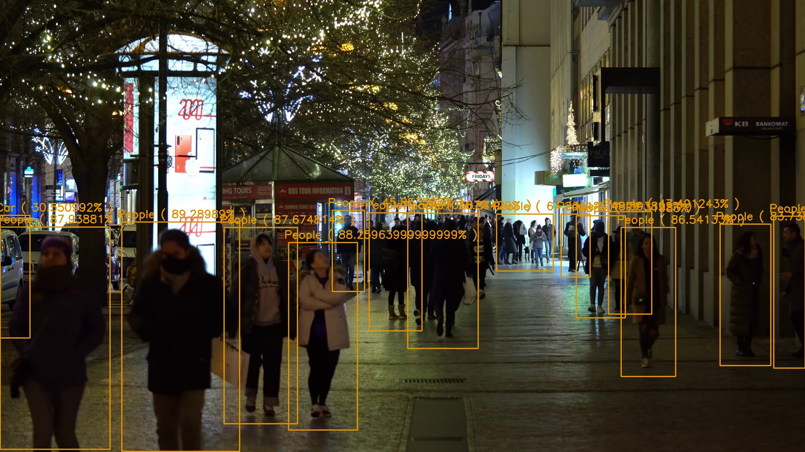
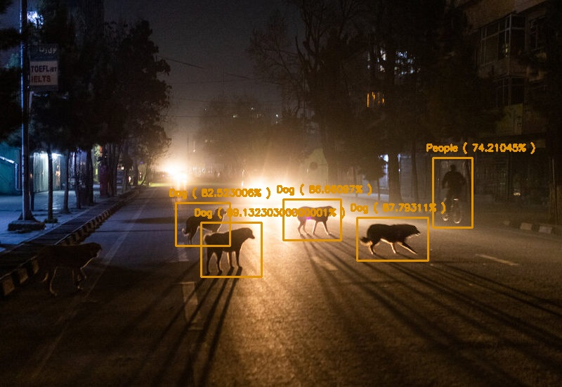
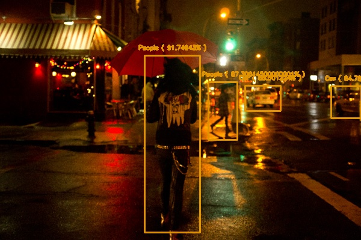
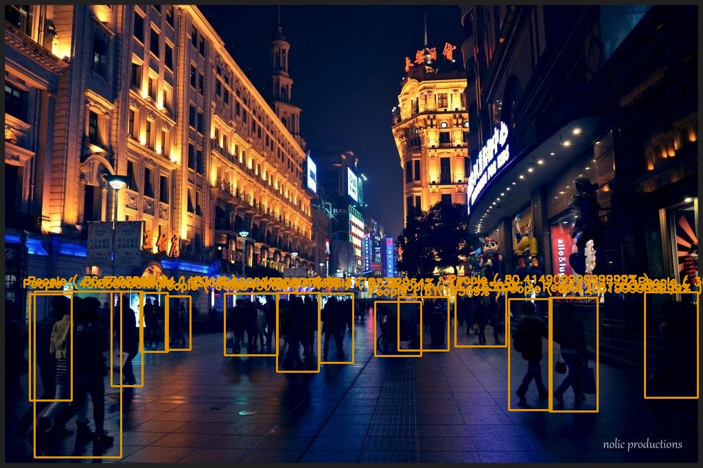
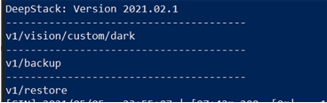
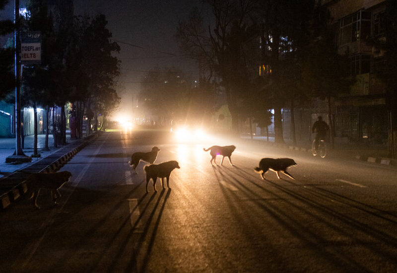

# DeepStack_ExDark

This repository provides a custom DeepStack model that has been trained and can be used for creating a new `object detection API` for detecting **12 common objects** (including people) in the **dark/night** images and videos. The Model was trained on the [ExDark dataset](https://github.com/cs-chan/Exclusively-Dark-Image-Dataset) dataset.


- **Create API and Detect Objects**
- **Discover more Custom Models**
- **Train your own Model**










# Create API and Detect Objects

The Trained Model can detect the following objects in dark/night images and videos. 

- Bicycle
- Boat
- Bottle
- Bus
- Chair
- Car
- Cat
- Cup 
- Dog
- Motorbike
- People
- Table

To start detecting, follow the steps below

- **Install DeepStack:** Install DeepStack AI Server with instructions on DeepStack's documentation via [https://docs.deepstack.cc](https://docs.deepstack.cc/index.html#installation)
- **Download Custom Model:** Download the trained custom model `dark.pt` for ExDark from  [this GitHub release](https://github.com/OlafenwaMoses/DeepStack_ExDark/releases/tag/v1). Create a folder on your machine and move the downloaded model to this folder.

    E.g A path on Windows Machine `C\Users\MyUser\Documents\DeepStack-Models`, which will make your model file path `C\Users\MyUser\Documents\DeepStack-Models\dark.pt`

- **Run DeepStack:** To run DeepStack AI Server with the custom ExDark model, run the command that applies to your machine as detailed on DeepStack's documentation [linked here](https://docs.deepstack.cc/custom-models/deployment/index.html#starting-deepstack).

    E.g

    For a Windows version, you run the command below
    ```bash
    deepstack --MODELSTORE-DETECTION "C\Users\MyUser\Documents\DeepStack-Models" --PORT 80
    ```

    For a Linux machine
    ```bash
    sudo docker run -v /home/MyUser/Documents/DeepStack-Models:/modelstore/detection -p 80:5000 deepquestai/deepstack
    ```
    Once DeepStack runs, you will see a log like the one below in your `Terminal/Console`

    

    That means DeepStack is running your custom `dark.pt` model and now ready to start detecting objects in night/dark images via the API endpoint `http://localhost:80/v1/vision/custom/dark` or `http://your_machine_ip:80/v1/vision/custom/dark`

- **Detect Objects in night image:** You can detect objects in an image by sending a `POST` request to the url mentioned above with the paramater `image` set to an `image` using any proggramming language or with a tool like POSTMAN. For the purpose of this repository, we have provided a sample Python code below.

    - A sample image can be found in `images/image.jpg` of this repository


    

    - Install Python and install the **DeepStack Python SDK** via the command below
        ```bash
        pip install deepstack_sdk
        ```
    - Run the Python file `detect.py` in this repository.

        ```bash
        python detect.py
        ```
    - After the code runs, you will find a new image in `images/image_detected.jpg` with the detection visualized, with the following results printed in the Terminal/Console.

        ```
        Name: People
        Confidence: 0.74210495
        x_min: 616
        x_max: 672
        y_min: 224
        y_max: 323
        -----------------------
        Name: Dog
        Confidence: 0.82523036
        x_min: 250
        x_max: 327
        y_min: 288
        y_max: 349
        -----------------------
        Name: Dog
        Confidence: 0.86660975
        x_min: 403
        x_max: 485
        y_min: 283
        y_max: 341
        -----------------------
        Name: Dog
        Confidence: 0.87793124
        x_min: 508
        x_max: 609
        y_min: 309
        y_max: 370
        -----------------------
        Name: Dog
        Confidence: 0.89132285
        x_min: 286
        x_max: 372
        y_min: 316
        y_max: 393
        -----------------------
        ```

        
    - You can try running detection for other night/dark images.

# Discover more Custom Models

For more custom DeepStack models that has been trained and ready to use, visit the Custom Models sample page on DeepStack's documentation [https://docs.deepstack.cc/custom-models-samples/](https://docs.deepstack.cc/custom-models-samples/) .


# Train your own Model

If you will like to train a custom model yourself, follow the instructions below.

- **Prepare and Annotate:** Collect images on and annotate object(s) you plan to detect as [ detailed here ](https://docs.deepstack.cc/custom-models/datasetprep/index.html)
- **Train your Model:** Train the model as [detailed here](https://docs.deepstack.cc/custom-models/training/index.html)